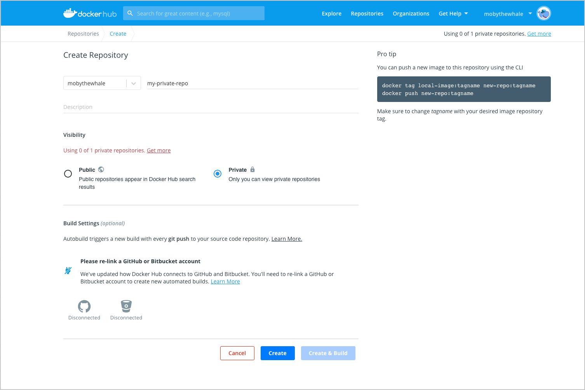
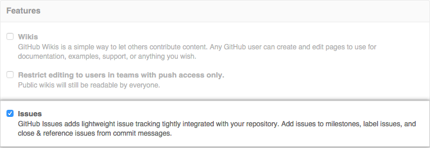
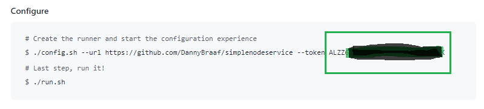
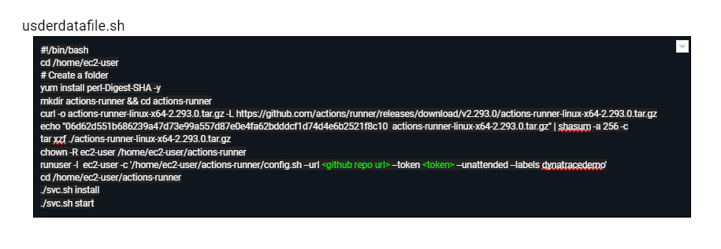
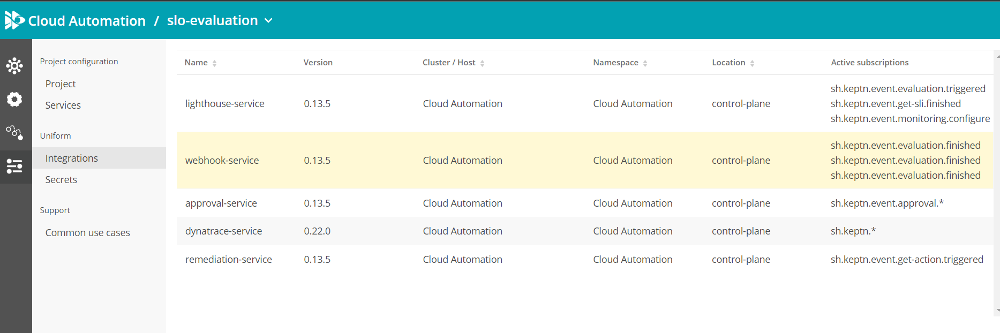

# Prerequisites  
<br>
 
### The following Accounts and Tokens are needed to create this Sandbox 
<br>

|  Vendor      | Prerequisite |
| ----------- | ----------- |
| Dynatrace   | Account, Api Token, Data Ingest Token        |
| Dynatrace Cloudautomation  | Account, Api Token      |
| AWS  | Account      |
| Dockerhub  | Account, Access Token      |
| Github  | Account, Personal Access Token      |

<br>

# Sandbox Setup
<br>

## Create a repository in Docker Hub
<br>

* Log in to hub.docker.com.
* Click Create a Repository on the Docker Hub welcome page.
* Name it <your-username>/my-private-repo. (any name of your choice)
* Set the visibility to Public.

  
<br>

## Create a Repo from Templace

<br>

* Login to your GitHub account.
* Navigate to the https://github.com/danatrace/continuousimprovement repo.
* Click the "use this Template Button", give it any name that you would like.
* Now, navigate to your new repository. 
* Create a dev and staging branche from the master Branche, to do so click on the Master Branche Button on the main page
  of your repository, then click view all branches, click on the New Branche button.

<br>

## Enable Issues for your Github Repository

* Navigate to the main page of the repository. Under your repository name click Settings,
  Under Features, select the Issues checkbox.

  

<br>

## Enable Github Workflow Actions for your Github Repository

* Navigate to the home of your new Github Repository and click on Actions
* Click the Green button to enable Github Workflows


  

<br>


## Create Github Environment Variable Secrets


* Navigate to the home of your Github Repository and click on Settings
* Click Secret -> Actions in the menu on the left

  

<br>

* Click on the “New repository secret” button and create the following secrets

    |  Variable    | info | where to find it |
    | ----------- | ----------- | ----------- |
    | CA_TOKEN   |  Cloudautomation Token   | Cloudautomation UI
    | DOCKERHUB  |  Dockerhub Token   | Dockerhub
    | DOCKER_USER   | Dockerhub User     | Dockerhub
    | DT_API_TOKEN  | Dynatrace Api Token   | Access Token in Dynatrace
    | DT_URL   | Dynatrace URL  | for example https://xxxxx.live.dynatrace.com
    | DT_API_URL  | Dynatrace API URL    | for example https://xxxxx.live.dynatrace.com/api
    | DT_CA_URL   | Cloudautomation URL    | for example https://xxxx.cloudautomation.live.dynatrace.com
    | DT_DATAINGESTTOKEN  | Dynatrace Data Ingest Token base64 encoded   | In Dynatrace click on create a new Active Gate, in the setup page create new tokens and download the dynacube.yaml In the Dynacube.yaml you will fin d the base64 encoded Data ingest token
    | DT_API_TOKEN_B64   |  Dynatrace Api Token   | In Dynatrace click on create a new Active Gate, in the setup page create new tokens and download the dynacube.yaml In the Dynacube.yaml you will fin d the base64 encoded Data ingest token
    | WORKFLOW_TOKEN  | Github Personal Access Token    | Githui UI


<br>

## Create Github Project (by running workflow)

* Navigate to the home of your Github Repository and click on Actions
* In the Workflow Overview click on the "Create Project Board" Workflow in the Menu

  

<br>

* Click the Run Workflow Button on the right, chose the Master Branch and Click  the Green Run  Workflow Button

  

<br>

* Wait until the Workflow run has finished

  

<br>

* Click on Projects in the Menu
* Click on Projects (Classic)
* Click on the Simplenodeservice Project

  

<br>


* Put the Project Columns into the right order via drag and drop (When the workflow creates the project it doesn’t keep the order) todo, in progress, Ready for Review, Done, Shipped


  

<br>


## Create Github Environment


* Navigate to the home of your Github Repository and click on Settings
* Click Environments in the left Menu

  
<br>

* Click on the “New Environment” Button

  
<br>

* Create Environment with the Name “production-approval”

  
<br>

* Activate Required reviewers and add yourself 

  
<br>

## Create new Github Runner

* Navigate to the home of your Github Repository and click on Settings
* On the settings page click on Actions - Runners

  
<br>

* In the runners overview click on the green “New Self-hosted runner” button

  
<br>

* On the Create Runners page select “Linux”

  
<br>


* Copy the token from the Configure script

  
<br>


* Copy the entire Content of the “aws/userdatafile.sh” file in your Github Repository to a local text file editor,  replace "< token >" with the token you have copied from the configure script and "< github repourl >" with the url to the repository you have created. Save the script we wil need it for installation of the AWS instance.

  
<br>

* Do not close the Github Runner Installation page until the installation of the AWS Instance in the next step has been created.

<br>
<br>

## AWS Set Up

* Logon to the AWS Management Console and Navigate to EC2
* Click on the “Launch Instances” button

  
<br>

* Chose AMI (Amazon Linux 2 AMI Kernel 4)

  
<br>

* Choose Instance Type T3.xlarge and click next


  
<br>


* Scroll to the Bottom of the page until you get to Advanced Details - User data, paste the content
  of the userdatafiel.sh with the replaced token and github url into the user data field.

  
<br>


* Add Storage (50GB General Purpose SSD) and click on next
* Optional Add Tags
* Create a Security Group with the following entries (click my IP will enter your IP address making the instance only available from your ip address!) Review and Launch instance.

  
<br>

* Wait until your instance is in “Running” State
* Go back to your Github runner install page and click on Actions - Runners.  The Runner started and should be in Idle state as seen below (with a different ip address than in the picture)

  
<br>


## Start Github Install Workflow 


The Workflow will create the following Demo Content:

* Dashboards (Dynatrace)
* Auto-Tags (Dynatrace)
* Management Zones (Dynatrace)
* Alerting Profiles (Dynatrace)
* Anomally detection metrics (Dynatrace)
* Custom Metrics (Dynatrace)
* A single node K3S Kubernetes Cluster (AWS instance)
* A Dynatrace Agent (AWS instance)
* A Dynatrace Active Gate (AWS instance)
* A Cloud Automation Project (Dynatrace)
* SLOs in Cloud Automation (Dynatrace)
* A Service in Cloud Automation (Dynatrace)

<br>

* Navigate to the home of your Github Repository and click on Actions
* In the Actions view Click on the “Install Demo” Workflow

   
<br>

* Now click the”Run workflow” button
* Chose run from “Master” Branche
* Click on the Green Run Workflow button

   
<br>

* Wait until workflow finished

   
<br>

## Create Webhooks in Cloudautomation

* Go to your Cloudautomation instance
* the Install Workflow has created a project called "slo-evaluation" and "deployment-gates" go into the slo-evaluation project and click on settings, in settings click on integrations and chose Webhook-Service

   
<br>


* scroll to the bottom of the page and click on "add subscription"
* in Add Subcription select Task evaluation and Task suffix finished
* Filter by stages dev, staging, production
* Requst Method POST
* enter the Url  < your dnyatrace url >/api/v1/entity/infrastructure/custom/custom:releaseevaluationscore
* add headers accept = application/json, Authorization=Api-Token < your dynatrace api token >, content-type=application/json
* add Custom Payload
```
{
    "type": "test",
    "series": [
        {
            "timeseriesId": "custom:releaseevaluationscore",
            "dimensions": {
                "Score": {
                    {.data.evaluation.score
                    }
                },
                "Result": "{{.data.result}}",
                "Passed": 0,
                "Releaseversion": "{{.data.labels.buildId}}",
                "Buildversion": "{{.data.labels.buildId}}",
                "Buildnumber": {
                    {.data.labels.buildId
                    }
                },
                "Evaluationtime": "{{.time}}",
                "Application": "simplenodeservice-{{.data.stage}}"
            },
            "dataPoints": [
                [
                    {
                        {.data.labels.evaltime
                        }
                    },
                    {
                        {.data.evaluation.score
                        }
                    }
                ]
            ]
        }
    ]
}
```

* Scroll to the bottom of the page and click the "update subcription" button
* Repeat the same steps as above for the deployment-gates project but with the following content as
payload:

```
{
    "type": "test",
    "series": [
        {
            "timeseriesId": "custom:releaseevaluationscore",
            "dimensions": {
                "Score": {
                    {.data.evaluation.score
                    }
                },
                "Result": "{{.data.result}}",
                "Passed": 0,
                "Releaseversion": "{{.data.labels.buildId}}",
                "Buildversion": "{{.data.labels.buildId}}",
                "Buildnumber": {
                    {.data.labels.buildId
                    }
                },
                "Evaluationtime": "{{.time}}",
                "Application": "simplenodeservice-{{.data.stage}}-DG"
            },
            "dataPoints": [
                [
                    {
                        {.data.labels.evaltime
                        }
                    },
                    {
                        {.data.evaluation.score
                        }
                    }
                ]
            ]
        }
    ]
}

```


## Set Workflow Variables

* Navigate to the home of your Github Repository
* Change Current Branche to “Dev”

   
<br>


* Switch into directory .”github/workflow”

   
<br>


* Open the dev.yml file for edit

   
<br>


* Set the env: variables

|  Variable    | info | Where to find it
| ----------- | ----------- | ----------- |
| GITHUB_PROJECT_URL | https url to the Project of your Github Repo created earlier | 
| DOCKER_REPO_URL | Link to the Docker Hub Repo created in the first step | 
| DT_URL | Dynatrace URL | 
| DT_MZ_ID | Dynatrace Management zone id | the install workflow has created a Management Zone called "tnt-acer-svc" in your Dynatrace instanceyou can get the ID from a Dashboard link where the management zone wa set (gf=246278738970986)
| DT_DEV_DB_ID | Dynatrace Dev Slo Dashboard id | The Install workflow has created a Dashboard Called KQG;project=slo-evaluation;stage=dev;service=tnt-acer-svc, go to this dashboard and get the id from the url (;id=76196020-e322-42c2-bc82-f7868171247e)
| DT_STAGING_DB_ID | Dynatrace Staging Slo Dashboard id | The Install workflow has created a Dashboard Called KQG;project=slo-evaluation;stage=staging;service=tnt-acer-svc, go to this dashboard and get the id from the url (;id=76196020-e322-42c2-bc82-f7868171247e)
| DT_PROD_DB_ID | Dynatrace Production Slo Dashboard id | The Install workflow has created a Dashboard Called KQG;project=slo-evaluation;stage=production;service=tnt-acer-svc, go to this dashboard and get the id from the url (;id=76196020-e322-42c2-bc82-f7868171247e)
| DOCKER_TAG | Docker tag of your Ducker hub repo created in the first step | 


* Commit the changes with blank commit message
* Repeat the steps with staging.yml (in dev branche!)
* Commit the changes with blank commit message
* Repeat the steps with master.yml (in dev branche!)
* Commit the change with the following commit message “demo first” This will start the Demo Workflow and Deploy the Initial Application to Dev, Staging


## Follow Initial Demo Workflow Run


